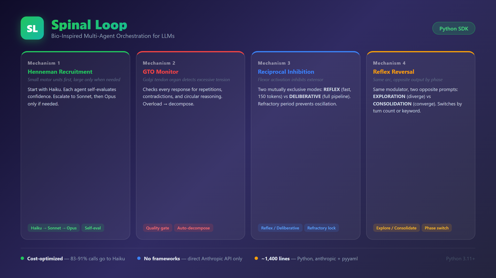

# Spinal Loop Orchestrator

[](https://github.com/contactjccoaching-wq/spinal-loop)
[](https://opensource.org/licenses/MIT)

**Bio-inspired multi-agent orchestration for LLMs.**



[](https://www.python.org/downloads/)
[](LICENSE)
[](https://docs.anthropic.com/)

> What if we borrowed design patterns from the neuromuscular system to route LLM calls?

Spinal Loop uses four mechanisms from neuromuscular physiology as a design framework for multi-agent orchestration: ordered recruitment, overload detection, mutually exclusive modes, and context-dependent phase switching.

It's an exploration — a way to think about multi-agent routing through a biological lens rather than ad-hoc heuristics. The code is functional but experimental.

No frameworks. No abstractions. Direct Anthropic API calls only.

---

## Architecture

```
                          User Query
                              |
                    +---------v---------+
                    |   MODE CLASSIFIER |  Reciprocal Inhibition
                    |      (Haiku)      |  REFLEX vs DELIBERATIVE
                    +---------+---------+
                              |
              +---------------+---------------+
              |                               |
     +--------v--------+           +----------v----------+
     |     REFLEX       |           |     DELIBERATIVE     |
     |  Haiku, 150 tok  |           |                      |
     |  No chain-of-    |           |  +----------------+  |
     |  thought, direct |           |  |   HENNEMAN     |  |
     +--------+---------+           |  |   RECRUITER    |  |
              |                     |  |                |  |
              |                     |  | Haiku (Lv1)    |  |
              |                     |  |   | escalate?  |  |
              |                     |  | Sonnet (Lv2)   |  |
              |                     |  |   | escalate?  |  |
              |                     |  | Opus (Lv3)     |  |
              |                     |  +-------+--------+  |
              |                     |          |           |
              |                     |  +-------v--------+  |
              |                     |  |  GTO MONITOR   |  |
              |                     |  |  Overload?     |  |
              |                     |  |  Y: decompose  |  |
              |                     |  |  N: pass       |  |
              |                     |  +-------+--------+  |
              |                     |          |           |
              |                     |  +-------v--------+  |
              |                     |  |   MODULATOR    |  |
              |                     |  | EXPLORE phase: |  |
              |                     |  |   diverge      |  |
              |                     |  | CONSOLIDATE:   |  |
              |                     |  |   converge     |  |
              |                     |  +-------+--------+  |
              |                     +----------+-----------+
              |                                |
              +----------------+---------------+
                               |
                           Response
```

## The 4 Mechanisms

| # | Mechanism | Biological Analogy | What it does |
|---|-----------|-------------------|--------------|
| 1 | **Henneman's Principle** | Motor neurons recruit small units first, large only when needed | Start with Haiku. Each agent self-evaluates confidence and complexity. Escalate to Sonnet, then Opus only if the previous level says it's not enough. |
| 2 | **GTO / Autogenic Inhibition** | Golgi tendon organ detects excessive tension and inhibits contraction | A monitor agent checks every response for repetitions, excessive length, and circular reasoning. If detected: inhibit, decompose into subtasks, redistribute. |
| 3 | **Reciprocal Inhibition** | Flexor activation inhibits extensor — mutually exclusive | Two modes: REFLEX (fast, Haiku-only, 150 tokens) and DELIBERATIVE (full pipeline). A refractory period prevents rapid switching between modes. |
| 4 | **Reflex Reversal** | Same reflex arc, opposite output depending on locomotion phase | Same modulator agent with two opposite prompts. EXPLORATION phase diverges, CONSOLIDATION phase converges. Switches by turn count or keyword. |

### 1. Henneman's Principle — Ordered Recruitment

Each agent includes a self-evaluation block in its response:

```json
{"confidence": 0.4, "complexity": 0.85, "escalate": true, "reason": "..."}
```

If `confidence < 0.7` OR `complexity > 0.7` → escalate to the next level. The previous agent's response is passed as context, so the stronger model builds on it rather than starting from scratch.

In simulation, a philosophy question escalated through all 3 levels:
- **Haiku** (confidence: 0.4) → surface-level answer → ESCALATE
- **Sonnet** (confidence: 0.55) → added historical context → ESCALATE
- **Opus** (confidence: 0.93) → full analysis with contemporary critics → ACCEPTED

### 2. GTO — Overload Monitor

LLMs have a known failure mode: when a question is too broad, they produce repetitive or circular responses. The GTO monitor attempts to detect this automatically:
- Repetitions (same concept >3 times)
- Excessive length (>2x expected)
- Internal contradictions
- Circular reasoning

When overload is detected, the monitor inhibits the response, decomposes the question into focused subtasks, and redistributes them.

### 3. Reciprocal Inhibition — Mode Switching

A classifier (Haiku, <100 tokens) determines if the query needs a quick reflex or deep deliberation. The two modes are mutually exclusive.

The **refractory period** (3 turns) prevents oscillation. Once in REFLEX mode, the system stays there for at least 3 turns. This is borrowed from neuroscience — biological neurons can't refire immediately after an action potential.

**Known limitation:** the classifier is the single point of failure. If Haiku misclassifies a complex question as simple, the full pipeline is bypassed. A real deployment would need a more robust classification strategy.

### 4. Reflex Reversal — Phase Modulation

The same modulator agent runs two opposite system prompts depending on the conversation phase:

- **EXPLORATION** (early turns): "Amplify divergent ideas, add unexpected connections"
- **CONSOLIDATION** (later turns or keyword trigger): "Force convergence, eliminate redundancies"

Phase switches automatically after N turns (configurable) or when the user says "summarize", "conclude", "synthesize".

---

## Quick Start

```bash
git clone https://github.com/contactjccoaching-wq/spinal-loop.git
cd spinal-loop
pip install -r requirements.txt

# Set your Anthropic API key
export ANTHROPIC_API_KEY="sk-ant-your-key-here"

# Interactive mode
python main.py

# One-shot mode
python main.py "What are the philosophical implications of AI consciousness?"
```

## Run the Simulation (No API Key Needed)

See all 4 mechanisms in action with mocked responses:

```bash
python simulate.py
```

This runs 6 queries through the real orchestration code with mock API responses:

| Turn | Query | Mechanism Triggered |
|------|-------|-------------------|
| 1 | "What is the capital of France?" | **Mode Switch** → REFLEX |
| 2 | "Is it in Europe?" | **Refractory period** (REFLEX locked) |
| 3 | "What currency?" | **Refractory** (last locked turn) |
| 4 | "Compare Kant and Nietzsche on morality" | **Henneman** escalade: Haiku → Sonnet → Opus |
| 5 | "Describe the complete history of computing" | **GTO** overload → decompose into 3 subtasks |
| 6 | "Synthesize everything" | **Reflex Reversal** → CONSOLIDATION |

There's also a multi-scenario simulation (`simulate_scenarios.py`) testing 3 realistic profiles — developer, general public user, and office employee — with 6 queries each (17/18 pass, 1 mock classifier limitation).

## Configuration

All thresholds are in `config.yaml`:

| Parameter | Default | Description |
|-----------|---------|-------------|
| `henneman.confidence_threshold` | 0.7 | Below this → escalate |
| `henneman.complexity_threshold` | 0.7 | Above this → escalate |
| `gto.max_repetitions` | 3 | Same concept repeated N times → overload |
| `gto.length_multiplier` | 2.0 | Response >2x expected length → overload |
| `mode_switch.refractory_period` | 3 | Minimum turns before mode can switch again |
| `mode_switch.reflex_max_tokens` | 150 | Token limit in REFLEX mode |
| `modulator.phase_switch_turn` | 5 | Turn number for automatic EXPLORATION → CONSOLIDATION |
| `modulator.consolidation_keywords` | see file | Keywords that trigger CONSOLIDATION phase |

## Simulation Cost Breakdown

From the mock simulations (not real API benchmarks):

| Scenario | API calls | Haiku % | Sonnet | Opus | Total tokens |
|----------|----------|---------|--------|------|-------------|
| Developer (6 turns) | 22 | 91% | 1 call | 1 call | 3,711 |
| Employee (6 turns) | 24 | 83% | 2 calls | 2 calls | 4,388 |

The design pushes most calls to the cheapest model. Expensive models are only recruited when the cheaper one explicitly says it can't handle the task. Whether this translates to meaningful cost savings in production depends on the actual query distribution — these numbers are from simulated scenarios, not real-world benchmarks.

## How It Compares

Existing systems that address similar problems:

| System | Approach | Difference from Spinal Loop |
|--------|----------|---------------------------|
| **OpenRouter** | Routes to cheapest model per request based on benchmarks | No progressive escalation, no post-response quality check |
| **Martian** | ML-based model selection optimizing cost/quality | No self-evaluation by the model itself |
| **FrugalGPT** | Cascade through models using external quality scorer | Similar escalation idea, but scorer is external, not agent self-evaluation |
| **LangChain** | Framework for building agent pipelines | General-purpose — doesn't prescribe routing strategy |

Spinal Loop's specific contributions are the GTO overload monitor (post-response quality gate with automatic decomposition) and the refractory period (mode-switching hysteresis). The biological framing is a design choice, not a performance claim.

## Project Structure

```
spinal_loop/
├── config.yaml                # All thresholds and parameters
├── main.py                    # CLI entry point (one-shot + interactive)
├── orchestrator.py            # Main pipeline coordinating all 4 mechanisms
├── simulate.py                # 6-query simulation with mock API
├── simulate_scenarios.py      # 3 realistic scenarios (dev, public, employee)
├── agents/
│   ├── recruiter.py           # Henneman — ordered recruitment with escalation
│   ├── monitor.py             # GTO — overload detection and decomposition
│   ├── mode_switch.py         # Reciprocal inhibition — REFLEX/DELIBERATIVE
│   └── modulator.py           # Reflex reversal — EXPLORATION/CONSOLIDATION
└── utils/
    ├── logger.py              # Biological event logging (colored + file)
    └── context.py             # Shared session state management
```

~1,400 lines of Python. No dependencies beyond `anthropic` and `pyyaml`.

## Biological Events Log

Every decision is logged with its biological event type:

```
[CLASSIFY]   Haiku classifier → REFLEX or DELIBERATIVE
[SWITCH]     Mode transition (with refractory lock)
[RECRUIT]    Agent recruited at level N
[ESCALADE]   Confidence too low → escalate to next level
[OVERLOAD]   GTO monitor checks response quality
[INHIBITION] Overload detected → inhibit and decompose
[DECOMPOSE]  Split into subtasks for redistribution
[MODULATE]   Apply EXPLORATION or CONSOLIDATION lens
[REVERSAL]   Phase switch triggered
```

## Limitations

- **Classifier dependency** — the Haiku classifier is a single point of failure. Misclassification sends the query down the wrong path.
- **Self-evaluation reliability** — agents evaluate their own confidence, which is inherently unreliable. A model that's wrong with high confidence won't trigger escalation.
- **Mock-only validation** — the simulations use hardcoded mock responses. The system hasn't been stress-tested with real API calls at scale.
- **Overhead on simple queries** — the DELIBERATIVE pipeline adds multiple API calls (classifier + agent + monitor + modulator). For simple queries correctly classified as REFLEX, this overhead is avoided — but misclassified simple queries pay a high cost.

## Why the Biological Framing?

The neuromuscular analogies aren't just labels. They provide a coherent design vocabulary:

- **Recruit minimum force** → recruit minimum cost (Henneman)
- **Detect overload before rupture** → detect quality degradation before the user sees it (GTO)
- **Lock action mode to prevent oscillation** → refractory period prevents mode thrashing
- **Reverse behavior based on phase** → same agent, opposite prompts, context-dependent

Whether this framing produces better systems than non-biological heuristics is an open question. The value is in the structured thinking it imposes, not in any claim of biological equivalence.

## Requirements

- Python 3.11+
- `anthropic>=0.25.0`
- `pyyaml>=6.0`
- An Anthropic API key (for real usage; simulation works without one)

## Related Projects

- [**immune**](https://github.com/contactjccoaching-wq/immune) — Adaptive memory system — learns patterns from every scan (+85% code quality)
- [**chimera**](https://github.com/contactjccoaching-wq/chimera) — Bio-inspired 3-stage pipeline (Slime Mold → PRISM → Immune)
- [**prism-framework**](https://github.com/contactjccoaching-wq/prism-framework) — Multi-agent synthesis via native LLM stochasticity
- [**daco-framework**](https://github.com/contactjccoaching-wq/daco-framework) — Declarative Agent & MCP Orchestration on Cloudflare Workers
- [**smartrabbit-mcp**](https://github.com/contactjccoaching-wq/smartrabbit-mcp) — AI workout generator MCP server ([smartrabbitfitness.com](https://www.smartrabbitfitness.com))

## License

MIT — see [LICENSE](LICENSE).

---

*Built with direct Anthropic API calls. No LangChain. No abstractions. Just biology and code.*
